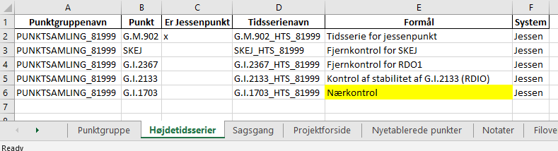

.. _punktsamlinger:

Arbejde med højdetidsserier og punktsamlinger i FIRE
====================================================
En højdetidsserie er en samling af koter, som alle er målt til det samme punkt, og som er
givet i det samme *højdesystem*. Når hver kote i tidsserien er beregnet ved fastholdelse
af det samme punkt med samme kote kaldes koterne i tidsserien for *jessenkoter* og
tidsseriens højdesystem siges at være et *lokalt højdesystem*. Det fastholdte punkt kaldes
for *jessenpunktet* og jessenpunktets fastholdte kote kaldes *referencekoten*.

En samling af højdetidsserier, som alle har samme jessenpunkt og referencekote, kaldes en
*punktsamling* eller *punktgruppe*.

.. note::
    Vær opmærksom at højdetidsseriernes jessenkoter ofte bare kaldes koter. Tilsvarende kaldes
    referencekoten ofte bare for *jessenkoten*!

Arbejdet med højdetidsserier kan inddeles i kategorierne vedligehold og analyse.
Tilsvarende findes der workflows i FIRE som understøtter disse arbejdsopgaver. De følgende
afsnit gennemgår disse to kategorier.

Arbejdet med højdetidsserier ligger i FIREs ``niv``-modul.

Vedligehold af punktsamling indebærer:
- at oprette og lukke
- beregn og indsætte nye koter til tidsserier

.. _ts_vedligehold:
Vedligehold af punktsamlinger og tidsserier
-------------------------------------------

Vedligehold vil sige at

.. _opret_ps:
Opret ny punktsamling
---------------------
* Opret ny sag og tilhørende sagsark

.. code-block::

    fire niv opret-sag MIN_SAG

* Opret punktsamling i sagsarket og rediger oplysningerne

.. code-block::

    fire niv opret-punktsamling MIN_SAG --jessenpunkt 81999

.. note::
    Hvis jessenpunktet ikke har et jessennummer skal det oprettes først. Se :ref:`opret_jessenpunkt`.

Der oprettes herefter to nye faner i sagsarket: **Punktgruppe** og **Højdetidsserier**.
Oplysningerne i de to faner redigeres indtil man er klar til at lægge dem i databasen.

* Rediger punktgruppe-fanen

  Det er muligt at redigere i punktgruppenavnet og formål. Det anbefales dog at beholde
  default-navnet ``PUNKTSAMLING_81xxx``

  .. image:: images/opret_punktgruppe_før.png

  .. image:: images/opret_punktgruppe_efter.png

* Rediger højdetidsserier-fanen

  Den første tidsserie tilhører jessenpunktet og oprettes i arket automatisk. Per
  definition er den konstant (den indeholder kun referencekoten), og er som sådan ret
  intetsigende. Dog er den af tekniske årsager nødvendig.

  .. image:: images/opret_højdetidsserie_før.png

  * Tilføj de ønskede punkter. Husk at angive punktgruppen i første kolonne.
  * Giv tidsserierne et sigende navn. Det anbefales kraftigt at bruge default-formen
    ``<ident>_HTS_<jessennummer>``

  .. image:: images/opret_højdetidsserie_efter.png

.. tip::
    | For at spare lidt tid med at indtaste værdierne i højdetidsserier-fanen kan man med
      fordel bruge ``--punkter`` valgmuligheden:

    .. code-block::

        fire niv opret-punktsamling MIN_SAG --jessenpunkt 81999 --punkter SKEJ,RDIO,RDO1

    | hvilket resulterer i flg:

    .. image:: images/opret_højdetidsserie_tip.png

    | Dette virker også med udtræk af punktsamlinger:

    .. code-block::

        fire niv udtræk-punksamling MIN_SAG --jessenpunkt 81999 --punkter SKEJ,RDIO,RDO1

* Til sidst lægges punktsamling og højdetidsserier i databasen::

      fire niv ilæg-punktsamling MIN_SAG
      fire niv ilæg-tidsserie MIN_SAG

.. _opret_jessenpunkt:
Opret nyt jessennummer
.......................
Før et punkt kan blive brugt som jessenpunkt, skal punktet have et jessennummer. Dette
gøres ved at indsætte attributten ``NET:jessen`` og angive det nye jessennummer med
``IDENT:jessen`` via de gængse kommandoer ``fire niv udtræk-revision`` og ``fire niv
ilæg-revision``.

Opret ny tidsserie i en punktsamling
------------------------------------
For at oprette en ny tidsserie i en punktsamling gøres følgende::

    fire niv udtræk-punktsamling MIN_SAG --punktsamlingsnavn PUNKTSAMLING_81999 --punkter G.I.1703

hvor ``--punkter`` angiver en kommasepareret liste, af de punkter som skal have en ny tidsserie.

.. image:: images/udtræk_højdetidsserie_før.png

Herefter kan formål for tidsserien rettes i fanen Højdetidsserier. Som det også er beskrevet under
:ref:`opret_ps`, så anbefales det at man så vidt muligt bruger tidsseriens
default-navn: ``<ident>_HTS_<jessennummer>``

Når man er tilfreds, lægges rettelserne i databasen::

    fire niv ilæg-punktsamling MIN_SAG
    fire niv ilæg-tidsserie MIN_SAG

Rediger eksisterende punktsamlinger og tidsserier
-------------------------------------------------
Der er begrænset mulighed for at redigere metadata for punktsamlinger og tidsserier, idet
kun formålet kan redigeres.
Idet det antages at der er oprettet en sag i forvejen, gøres følgende::

    fire niv udtræk-punktsamling MIN_SAG PUNKTSAMLING_81999

Rediger formål for punktsamlinger og tidsserier i sagsarket. Derefter ilægges ændringerne::

    fire niv ilæg-punktsamling MIN_SAG
    fire niv ilæg-tidsserie MIN_SAG

.. _opdater_ts:
Opdatering af højdetidsserier
-----------------------------
Opdatering af tidsseriekoter følger overordnet samme fremgangsmåde som ved opdatering af
almindelige DVR90-koter, med få undtagelser.

Det følgende springer let over de dele af beregningsflowet som der ikke er ændringer til,
og med nedslag de steder hvor der er undtagelser.

::

    opret-sag
    læs-observationer --kotesystem jessen

Normalt opbygger ``læs-observationer`` Punktoversigten med anvendelse af hvert observeret Punkts seneste *DVR90-kote*.
Ved anvendelse af det nye flag ``--kotesystem jessen`` fortæller man nu programmet, at
Punktoversigten skal opbygges ved hjælp af hver Punkts seneste *jessenkote* i stedet.
Denne kote bliver brugt til at vise koteændringer og opløft, når man har lavet en beregning.

.. note::

  Her skal man lige være opmærksom. Det er nemlig muligt for et punkt at indgå i flere
  Punktsamlinger (med forskellige jessenpunkter) og dermed have flere Højdetidsserier. *Den viste kote er den nyeste
  jessenkote iblandt alle punktets Højdetidsserier.* Dette kan lede til at koteændring og
  opløft senere kan komme til at se lidt underlige ud. Dette er ikke grund til bekymring og kan ignoreres.

  Det kan desuden ske, at man har opmålt nogle punkter, som slet ikke har en
  Højdetidsserie. I dette tilfælde vil de se ud på samme måde som nyetablerede punkter,
  altså med kote og spredning u-udfyldt.

Herefter skal man vælge et fastholdt punkt og dertil en fastholdt kote. *Dette skal være
et registeret jessenpunkt og referencekote*. Dette gøres ved først at udtrække
punktsamlingen, som er blevet opmålt::

    udtræk-punktsamling --punktsamlingsnavn "PUNKTSAMLING_81xxx"

Resultaterne af udtrækningen skrives til sagsarket i to nye faner **Punktgruppe** og
**Højdetidsserier**.

.. note::

  I ``udtræk-punktsamling`` kan du i stedet for  ``--punktsamlingsnavn "PUNKTSAMLING_81xxx"``,
  vælge at bruge ``--jessenpunkt 81xxx``

  Dette udtrækker alle Punktsamlinger der har punktet 81XXX som jessenpunkt. Man behøver
  desuden ikke at bruge jessenpunktets jessennummer. Alle jessenpunktets gyldige IDENT'er
  kan bruges, herunder lands- og GI-nummer.

  **Nedenstående er meget sjældent/unyttig/forvirrende info. Overvej at gem det langt væk eller slet**

  I de fleste tilfælde vil jessenpunktet kun være tilknyttet én Punktsamling og man behøver
  ikke gøre yderligere. Er jessenpunktet tilknyttet flere Punktsamlinger, skal man tage
  stilling til, hvilken Punktsamling man vil bruge. Jessenpunktet kan nemlig godt have
  forskellige referencekoter i de to Punktsamlinger.

Herefter sættes, som ved en normale beregning, et "x" ved jessenpunktet som skal fastholdes, og *ved
jessenpunktets kote skriver man den jessenkote som står i Punkgruppe-fanen.*

**Her skal der 100 % indsættes nogle screenshots som viser hvad jeg mener!**

Når man har valgt et fastholdt jessenpunkt og referencekote, kører man beregningerne som man plejer::

    # kontrol
    regn
    # endelig
    regn

Hvis man vil, er der tilføjet en ny valgmulighed ``--plot`` til ``regn`` kommandoen. Denne
giver mulighed for at se de et plot af de tidsserier man har udtrukket, med de nyberegnede
koter vist i forlængelse. Det skal understreges, at kun de tidsserier som fremgår af fanen
"Højdetidsserier" vil blive plottet. Punkter i beregningen, som ikke har en
højdetidsserie, og som derfor ikke fremgår af fanen "Højdetidsserier", vil altså ikke
blive plottet.

Beregningen afsluttes også som man plejer::

    ilæg-observationer
    ilæg-nye-koter

Der er ikke nye inputs til disse.

Vigtigt: ``ilæg-nye-koter`` kigger nu på kolonnen "System". Hvis der her står "Jessen", så
prøver den at finde en Højdetidsserie ovre i den tilsvarende fane, som koten skal knyttes
til. Hvis der ikke kan findes en HTS for et punkt, vil programmet brokke sig. Man kan
derefter gøre én af to ting:

  - Opret tidsserier for de punkter som ikke har én, i den korrekte punktsamling. (Se
    beskrivelse i :ref:`opret_ps`. Brug i ``udtræk-punktsamling`` med fordel
    valgmuligheden ``--punktoversigt``.)

eller

  - Udelad publikation. Sæt "x" i kolonnen ud for de pågældende punkter

Vigtigt: Når du kører ``ilæg-nye-koter`` vil programmet
kigge på det som står i fanen "Endelig beregning" og prøve at lægge alle de koter i
databasen, som ikke er sat til "Udelad publikation". (Som normalt!)

Skift af jessenpunkt
--------------------
Sommetider er det nødvendigt at udskifte jessenpunktet for en punktsamling. Enten fordi
jessenpunktet konstateres ustabilt, jessenpunktet er gået tabt eller anden årsag.

Der findes to måder at dette kan udføres på: en quick'n'dirty (transformation) og en stringent (genberegning).

Quick'N'Dirty
.............
Den hurtige og beskidte metode er til hurtige ad hoc beregninger eller analyser, hvor man
"transformerer" tidsseriekoterne fra det gamle, lokale højdesystem til det nye højdesystem.

Dette er fx praktisk i tilfældet hvor to tidsserier har forskellige bevægelser ift.
jessenpunktet. Her kan det være svært rent grafisk at anskue de to punkters bevægelse ift.
hinanden, hvorfor det kan hjælpe at ophøje det ene punkt til jessenpunkt, hvis bevægelse i
sit eget system pr. definition er 0.

Der tages udgangspunkt i den "gamle" tidsserie for det punkt som skal være det nye
jessenpunkt. *Denne tidsserie trækkes simpelthen bare fra de andre tidsserier i
punktsamlingen*. Dette kræver at tidsserierne er beregnet til de samme tidspunkter som det
nye jessenpunkt.

 Denne operation er faktisk ikke *så* dirty, idet det faktisk giver de samme koter som
 hvis man lavede en genberegning med et nyt fastholdt jessenpunkt. Dog vil de estimerede
 spredninger ikke blive transformeret, hvorfor denne metode ikke bør anvendes til
 tidsserier som skal lægges i databasen.

.. note::

    Dette er pt. ikke implementeret i FIRE. Vil man anvende denne metode kan det relativt
    let gøres ved at udtrække de tidsserier man er interesseret i med ``fire ts hts``, og
    derefter selv trække tidsserierne fra hinanden, eksempelvis i excel.

.. tip::

    Vil man være endnu mere dirty, så kan man interpolere imellem
    tidspunkterne i det nye jessenpunkts tidsserie for at kunne transformere data til de
    tidspunkter hvor tidsserien for det nye jessenpunkt ikke er blevet beregnet.

Den stringente
..............

I FIREs datamodel, er jessenpunktet definerende for en punktsamling, og derfor kan man
principielt ikke *skifte* jessenpunktet. Dog er det muligt at oprette en ny punktsamling
med det nye jessenpunkt, og som indeholder de samme punkter som den gamle punktsamling.

Derefter er det nødvendigt at genberegne tidsserierne, skridt for skridt, og ved hvert
skridt anvende det samme sæt af observationer som blev brugt til de gamle tidsserier, og
selvfølgelig med fastholdelse af det nye jessenpunkt.

For at kunne genskabe alle tidsskridt i de gamle tidsserier kræves at det nye jessenpunkt
har været opmålt i de samme kampagner som det gamle jessenpunkt.

**Fremgangsmåde:**

#. Giv nyt jessenpunkt et jessennummer med ``fire niv udtræk-revision`` og ``fire niv ilæg-revision``
#. Opret ny punktsamling med det nye jessenpunkt
#. Tilføj punkter og tidsserier til punktsamlingen
#. For hver tidspunkt i de gamle tidsserier:
    - Udtræk relevante observationer
    - Følg det gængse niv-workflow for beregning og ilægning af tidsseriekoter, som
      beskrevet i **INDSÆT REFERENCE**

.. tip::

    Step 2-3 gøres nemmest ved at udtrække den gamle punktsamling med ``fire niv
    udtræk-punktsamling`` og derefter redigere jessenpunkt, punktsamlingsnavn og formål og ilægge
    med ``fire niv ilæg-punktsamling``

.. list-table:: Opmålingstidsspunkt
   :widths: 25 25 50
   :header-rows: 1

   * - Heading row 1, column 1
     - Heading row 1, column 2
     - Heading row 1, column 3
   * - Row 1, column 1
     -
     - Row 1, column 3
   * - Row 2, column 1
     - Row 2, column 2
     - Row 2, column 3
Jessenpunkt  x
A            - - - - - - - - -
B

Analyse af højdetidsserier
--------------------------
Man bruger programmet :ref:`fire_ts_analyse-gnss:` til at analysere GNSS-tidsserier.
Programmet kan blabla

CASE:
...........
Dette skal ligge under Workshop!

.. warning::

  Inden du begynder, er det vigtigt at sørge for, at du ikke forbinder til
  produktionsdatabasen ved et uheld. Gør derfor følgende::

  Find din FIRE-konfigurationsfil ``fire.ini`` og ret default databaseforbindelsen til
  ``test`` i stedet for ``prod``. **Dette gør så du slipper for at skrive** ``--db test``
  efter hver eneste kommando i denne demo case.
  I toppen af filen skal der stå::

    [general]
    default_connection = test
    ...

  Kontrollér desuden længere nede i ``fire.ini`` at test-databaseforbindelsen er som følger
  (med password og username udfyldt)::

    [test_connection]
    password = ***
    username = ***
    hostname = exa-x10-r2-c1-scan.prod.sitad.dk
    service = FIRETEST.prod.sitad.dk
    schema = fire_adm

  Kør FIRE-kommandoen ``fire config`` for at tjekke, at FIRE kan finde din
  konfigurationsfil. Konrollér at oplysningerne står som beskrevet ovenfor.

  Når du er færdig med denne demo kan du, hvis du vil, rette default-forbindelsen tilbage
  til ``prod``.

Tjek at du har FIRE version ``1.8.0`` eller højere installeret. Skriv ``fire --version``.

En case hvor man gennemgår anlægningen, vedligeholdelsen og til sidst sløjfningen af en punktgruppe nær en CORS station.

En ny CORS station er blevet anlagt, sikringspunkter er etablereret og indmålt. Nu skal observationerne lægges i databasen.

Et punkt i en punktgruppe er tabtgået. Der er derfor etableret et nyt punkt som erstatning og
det er blevet indmålt i den eksisterende punkgruppe.

Følgende er blevet gjort i databasen:

- Det gamle punkt er meldt tabtgået (se :ref:`tabsmelding`)
- Det nye punkt er oprettet i FIRE (se :ref:`ilæg_nye_punkter`)

Derefter skal observationerne udjævnes og de beregnede koter tidsseriekoter skal lægges i
FIRE. For at lægge jessenkoten for det nyoprettede punkt i FIRE, skal der imidlertid først
oprettes en tidsserie som koten kan knyttes til.
