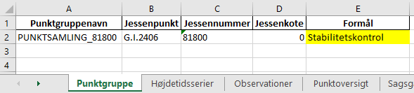

.. _htscase:

Case: Højdetidsserier
---------------------

Velkommen til denne lille case, hvor du vil blive klogere på at arbejde med
højdetidsserier i FIRE. Undervejs vil vi gennemgå den database-relaterede livscyklus for
et opdigtet 5D-punkt. Herunder bl.a. etablering, vedligeholdelsen og til sidst
sløjfningen af en punktgruppe nær et 5D-punkt. Vi kommer udover højdetidsserier, også
igennem oprettelse af nyetablerede punkter, lukning af punkter og bla bla.

Hent seneste version af FIRE
++++++++++++++++++++++++++++

For at følge trinnene i casen skal du have den nødvendige version af FIRE.

I terminalen stiller du dig i mappen hvor din FIRE-installation ligger. Den kunne fx hedde
``FIRE``::

    C:\> cd FIRE

Aktiver dit FIRE-miljø::

    C:\FIRE> mamba activate fire

Hent nyeste version af FIRE ned, og aktiver version ``1.8.0``::

    (fire) C:\FIRE>git checkout master
    (fire) C:\FIRE>git pull origin master --tags
    (fire) C:\FIRE>git checkout fire-1.8.0

Tjek at du har FIRE-version ``1.8.0`` eller højere installeret::

    fire --version

Opdater FIRE-miljø
++++++++++++++++++++++++++++

Sørg for at dit ``fire``-miljø er aktiveret, hvis det ikke allerede er aktiveret. Dernæst
skal vi have opdateret miljøet, da der i opgraderingen til FIRE version ``1.8.0`` er
kommet enkelte tilføjelser::

    (fire) C:\FIRE>mamba env update --file environment.yml --prune

.. _ret_default_db:
Ret default databaseforbindelsen
++++++++++++++++++++++++++++++++

.. warning::

  Inden du begynder, er det vigtigt at sørge for, at du ikke forbinder til
  produktionsdatabasen ved et uheld. Gør derfor følgende::

  Find din FIRE-konfigurationsfil ``fire.ini`` og ret default databaseforbindelsen til
  ``test`` i stedet for ``prod``. **Dette gør så du slipper for at skrive** ``--db test``
  **efter hver eneste kommando i denne demo case.**
  I toppen af filen skal der stå (uden de tre ``...``)::

    [general]
    default_connection = test
    ...

  Kontrollér desuden længere nede i ``fire.ini`` at test-databaseforbindelsen er som følger
  (med password og username udfyldt)::

    [test_connection]
    password = ***
    username = ***
    hostname = exa-x10-r2-c1-scan.prod.sitad.dk
    service = FIRETEST.prod.sitad.dk
    schema = fire_adm

  Kør FIRE-kommandoen ``fire config`` for at tjekke, at FIRE kan finde din
  konfigurationsfil. Kontrollér at oplysningerne står som beskrevet ovenfor.

  Når du er færdig med denne demo kan du, hvis du vil, rette default-forbindelsen tilbage
  til ``prod``.

Så går vi i gang
++++++++++++++++++++++++++++
Opret en mappe et passende sted til denne case, og stil dig i den. Kald den fx ``HTS_DEMO``.

Opret en sag, og giv den et kort og godt navn. Giv den evt. også en beskrivelse::

    fire niv opret-sag HTS_DEMO "En sag til min demo-case om Højdetidsserier"

Du vil blive spurgt, om du er sikker på om sagen skal oprettes i databasen. **Dobbelttjek
at du opretter sagen i test-databasen**. Hvis du er ved at oprette sagen i prod, skriv da ``nej``, og følg trinnene under :ref:`ret_default_db`.

::

    Sags/projekt-navn: HTS_DEMO  (2627a3f1-13a4-40bc-8a71-73a83ce4003c)
    Sagsbehandler:     B294041
    Beskrivelse:       En sag til min demo-case om Højdetidsserier
    Opretter ny sag i test-databasen - er du sikker?  (ja/NEJ):
    ja
    Gentag svar for at bekræfte (ja/NEJ)
    ja
    Sag 'HTS_DEMO' oprettet
    Skriver sagsregneark 'HTS_DEMO.xlsx'
    Filen 'HTS_DEMO.xlsx' findes ikke.
    Skriver: {'Nyetablerede punkter', 'Filoversigt', 'Parametre', 'Sagsgang', 'Notater', 'Projektforside'}
    Til filen 'HTS_DEMO.xlsx'
    Færdig!

Info om sagen kan til enhver tid ses ved at slå dens databaseid op (find det i output fra
forrige kommando, eller i sagsarket under fanen **Sagsgang**)::

    fire info sag 2627a3f1-13a4-40bc-8a71-73a83ce4003c
    >>
    ------------------------- SAG -------------------------
    Sagsid        : 2627a3f1-13a4-40bc-8a71-73a83ce4003c
    Oprettet      : 2024-10-16 15:29:27.054865
    Sagsbehandler : B294041
    Status        : Aktiv
    Beskrivelse   :

        HTS_DEMO: En sag til min demo-case om Højdetidsserier

Opret dit eget 5D-punkt
........................
Som det første, skal vi have oprettet jessenpunktet for vores nye punktgruppe. Dette gør
vi ved først at oprette det som et almindeligt punkt, og derefter tildele det et jessennummer.

Åbn QGIS eller lignende, og find et egnet sted i Danmark. Træk koordinaterne ud. I QGIS
kan det gøres med et enkelt højreklik på kortet:

.. image:: figures/qgis_ny5d.PNG

Skriv koordinaterne ind i sagsarkets fane **Nyetablerede punkter**. Udfyld
**Fikspunktstype** og **Afmærkning** som vist. I de andre felter kan du skrive hvad du vil.

.. image:: figures/nyetableret_5d.PNG

Læg punktet i databasen. Luk sagsarket og kør følgende::

    fire niv ilæg-nye-punkter HTS_DEMO

Åbn sagsarket igen og se at punktet nu er lagt i databasen og har fået tildelt et
landsnummer. Træk punktinfo ud via det nye landsnummer, og se at punktet også har fået et
nyt GI-nummer. Vi vil fremover bruge GI-nummeret frem for landsnummeret.

::

    fire info punkt 12-01-00838
    >>
    --------------------------------------------------------------------------------
    PUNKT G.I.2406
    --------------------------------------------------------------------------------
    Lokation                    POINT (12.3944 55.983371)
    Oprettelsesdato             2024-10-16 16:45:58.544396
    AFM:2950                    Skruepløk
    ATTR:beskrivelse            Et kongeligt fikspunkt.
    REGION:DK
    ATTR:bemærkning             Nyetb. 2024 B294041
    ATTR:GI_punkt
    IDENT:GI                    G.I.2406
    IDENT:landsnr               12-01-00838

    --- KOORDINATER ---

Tildel Jessennummer
...................
Nu skal punktet oprettes som jessenpunkt og tildeles et jessennummer. Udtræk
revisions-arket for punktet via det nye GI-nummer::

    fire niv udtræk-revision HTS_DEMO G.I.2406

Udtræk derefter alle nuværende punktsamlinger for at få en liste over jessennumre som allerede er i brug::

    fire info punktsamling
    >>
    Navn                                Jessenpunkt  Antal punkter  Antal tidsserier
    ----------------------------------  -----------  -------------  ----------------
    PUNKTSAMLING_81001                  81001        25             0
    Punktsamling for Jessenpunkt 81001  81001        59             59
    Punktsamling for Jessenpunkt 81002  81002        50             50
    ...
    ...
    Punktsamling for Jessenpunkt 81158  81158        28             28
    TEST_NY_PKTGRUPPE                   81500        5              0
    TEST_TOM_PKTGRUPPE                  81500        4              4
    TEST_SPARRING                       81600        10             12
    PUNKTSAMLING_81999                  81999        5              4

Vælg et nyt jessennummer, som ikke fremgår af listen (kolonnen "Jessenpunkt"), og skriv det ind i revisionsarket som vist:

.. image:: figures/nyt_jessennr.PNG

Husk at slette "x" fra kolonnen **Ikke besøgt**. Luk revisions- og sagsarket, og ilæg de nye attributter::

    fire niv ilæg-revision HTS_DEMO

Tjek at punktet har fået tildelt jessennummer og har attributterne ``NET:jessen`` og ``NET:5D``::

    fire info punkt G.I.2406
    >>
    --------------------------------------------------------------------------------
    PUNKT G.I.2406
    --------------------------------------------------------------------------------
    ...
    NET:jessen
    IDENT:jessen                81800
    NET:5D
    ...

Opret sikringspunkter
......................

Nu opretter vi 4 sikringspunkter omkring det nye 5D-punkt. Du kan gøre som før, ved selv
at indtaste nogle tilfældige koordinater ind i fanen **Nyetablerede punkter**. Alternativt
burde følgende tabel kunne kopieres ind i arket:

.. list-table::
    :widths: 25 25
    :header-rows: 0

    * - =C$2+0.001
      - =D$2+0.001
    * - =C$2+0.001
      - =D$2-0.001
    * - =C$2-0.001
      - =D$2+0.001
    * - =C$2-0.001
      - =D$2-0.001

Dette gør så de 4 punkter oprettes NV, NØ, SV og SØ for jessenpunktet.

.. image:: figures/nyetableret_sikringsgruppe.PNG

Ilæg punkterne::

    fire niv ilæg-nye-punkter HTS_DEMO

Tjek at punkterne er oprettet korrekt. Du kan fx gøre flg:

* Find de nye landsnumre i sagsarket
* Slå punkterne op med ``fire info punkt``
* Kør ``fire niv læs-observationer HTS_DEMO`` Der er selvfølgelig ikke nogen observationer
  endnu, men denne kommando laver også nogle geojson-filer som vi kan trække ind i QGIS.
* Find den oprettede geojson-fil, fx ``HTS_DEMO-punkter.geojson`` og træk den ind i QGIS::

.. image:: figures/indtræk_geojson.gif

Første opmåling
................
Der laves nu den første opmåling af vores punktgruppe. Først laver vi nogle indledende
øvelser for at simulere nogle nivellement-observationer.

Hent de 4 test-observationsfiler og gem dem i din test-mappe. I filerne er gemt de
observationer vi skal bruge til at udjævne og generere tidsserier i FIRE. Når du har
hentet filerne, skulle din mappestruktur gerne se nogenlunde sådan ud:

Åbn gerne nogle af mgl-filerne. Læg mærke til de generiske punktnavne som indgår::

    Jessenpunkt, Punkt-A, Punkt-D, Punkt-C, Punkt-D

Disse vil vi i det følgende, via lidt søg-og-erstat gymnastik, erstatte med identerne for
de punkter vi lige har oprettet.

Her er skabelonen for søg-og-erstat kommandoerne. Kør alle kommandoerne, hvor du erstatter
punktnavnene med dine egne punkter::

    sed -i 's/Jessenpunkt/<MitJessenpunkt>/g' test_obs_*.mgl
    sed -i 's/Punkt-A/<MitFørstePunkt>/g' test_obs_*.mgl
    sed -i 's/Punkt-B/<MitAndetPunkt>/g' test_obs_*.mgl
    sed -i 's/Punkt-C/<MitTredjePunkt>/g' test_obs_*.mgl
    sed -i 's/Punkt-D/<MitFjerdePunkt>/g' test_obs_*.mgl

Her et eksempel på hvordan søg-og-erstat kommandoerne kan se ud::

    sed -i 's/Jessenpunkt/G.I.2406/g' test_obs_*.mgl
    sed -i 's/Punkt-A/12-01-09158/g' test_obs_*.mgl
    sed -i 's/Punkt-B/12-01-09159/g' test_obs_*.mgl
    sed -i 's/Punkt-C/12-01-09160/g' test_obs_*.mgl
    sed -i 's/Punkt-D/12-01-09161/g' test_obs_*.mgl

Indlæs nu observationerne fra den første mgl-fil. Under fanen **Filoversigt** i sagsarket skriver du følgende:

.. image:: figures/filoversigt_2000.PNG

.. warning::

    Pga. en mindre, ikke-fatal fejl/uhensigtsmæssighed, som netop er opdaget i FIRE, så
    skal du lige slette indholdet af fanen **Nyetablerede punkter** , med undtagelse af
    overskrifterne.

    Fejlen gør så Punktoversigten bliver oprettet med dubletter af de nyoprettede punkter,
    hvis kanoniske ident er forskellig fra landsnummeret, dvs. vores nye GI-punkt.

Luk arket og indlæs observationerne med::

    fire niv læs-observationer HTS_DEMO --kotesystem Jessen

Parameteren ``--Jessen``, gør så programmet forsøger at finde punkternes seneste
jessenkote samt udfylder kolonnen **System** for dig. Hvis du glemmer at bruge denne
parameter kan du altid bare indtaste det i arket manuelt.

Tjek at punkterne nu står i fanen **Punktoversigt**. Du er nu klar til at oprette en punktgruppe og tidsserier.

.. image:: figures/punktoversigt_1.PNG

Opret punktgruppe og tidsserier
................................

 Kør følgende kommando. Dette opretter fanerne **Punktgruppe** og **Højdetidsserie** i
 sagsarket.

 ::

    fire niv opret-punktsamling HTS_DEMO --jessenpunkt 81800 --punktoversigt

Åbn sagsarket og rediger formål for punktsamlingen og de 5 tidsserier. Formålene er
fritekst-felter som man kan bruge til fx at give information om hvad punktgruppen og
tidsserierne skal bruges til. De må ikke lades være tomme, men må gerne være kortfattede:

.. image:: figures/højdetidsserier_fane_1.PNG

Læg mærke til, at referencekoten for punktsamlingens jessenpunkt (kolonnen **Jessenkote**)
er angivet til 0. Denne kolonne er kun til info, og ignoreres ved ilægning af
punktsamlingen. Nye punktsamlinger oprettes altid med referencekoten 0.

Ilæg Punktsamlingen og Højdetidsserierne::

    fire niv ilæg-punktsamling HTS_DEMO
    fire niv ilæg-tidsserie HTS_DEMO

Tjek at punktsamlingen og dens tidsserier er lagt i databasen::

    fire info punktsamling PUNKTSAMLING_81800
    >>
    ------------------------- PUNKTSAMLING -------------------------
    Navn          : PUNKTSAMLING_81800
    Formål        : Stabilitetskontrol
    Jessenpunkt   : G.I.2406
    Jessennummer  : 81800
    Jessenkote    : 0 m
    Antal punkter : 5
    --- Punkter ---
    G.I.2406
    12-01-09158
    12-01-09159
    12-01-09160
    12-01-09161
    --- Tidsserier ---
    Navn                                      Antal datapunkter  Type    Referenceramme
    ----------------------------------------  -----------------  ------  ------------------
    G.I.2406_HTS_81800                        0                  Højde   Jessen
    12-01-09161_HTS_81800                     0                  Højde   Jessen
    12-01-09160_HTS_81800                     0                  Højde   Jessen
    12-01-09159_HTS_81800                     0                  Højde   Jessen
    12-01-09158_HTS_81800                     0                  Højde   Jessen

Ret formål
..........
Du har indset, at "Stabilitetskontrol" var en lidt for intetsigende beskrivelse, og beslutter dig for at rette det.

Gå ind i sagsarket og ret punktsamlingens formål til noget andet. Derefter kører du samme kommandoer som før::

    fire niv ilæg-punktsamling HTS_DEMO
    fire info punktsamling PUNKTSAMLING_81800
    >>
    ------------------------- PUNKTSAMLING -------------------------
    Navn          : PUNKTSAMLING_81800
    Formål        : Kontrol af stabilitet
    Jessenpunkt   : G.I.2406
    Jessennummer  : 81800
    Jessenkote    : 0 m
    ...

Beregn første opmåling
......................
Som ved en normal beregning skal man vælge et fastholdt punkt og kote. Når du beskæftiger dig med
tidsserier skal dette svare til en punktsamlings jessenpunkt og referencekote. I
**Punktoversigt** og sætter du et "x" i kolonnen **Fasthold** ud for jessenpunktet, og i
kolonnen **Kote** skriver du 0 som vist:

Beregn nu nye koter::

    fire niv regn HTS_DEMO
    fire niv regn HTS_DEMO

Et punkt i en punktgruppe er tabtgået. Der er derfor etableret et nyt punkt som erstatning og
det er blevet indmålt i den eksisterende punkgruppe.

Følgende er blevet gjort i databasen:

- Det gamle punkt er meldt tabtgået (se :ref:`tabsmelding`)
- Det nye punkt er oprettet i FIRE (se :ref:`ilæg_nye_punkter`)

Derefter skal observationerne udjævnes og de beregnede koter tidsseriekoter skal lægges i
FIRE. For at lægge jessenkoten for det nyoprettede punkt i FIRE, skal der imidlertid først
oprettes en tidsserie som koten kan knyttes til.
